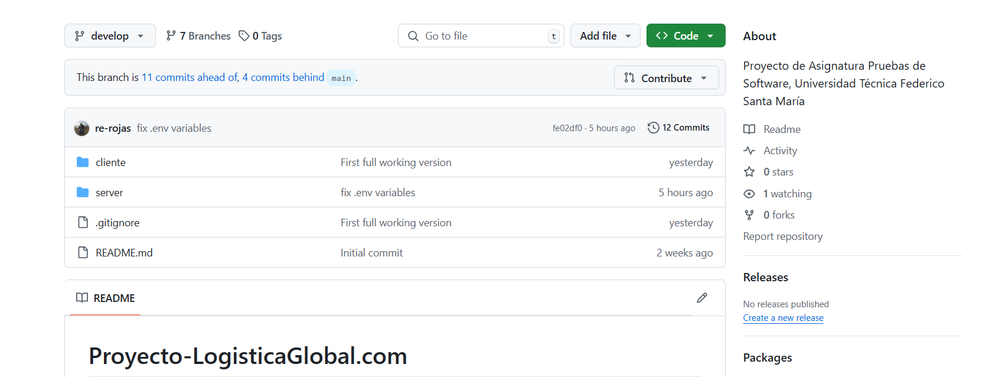
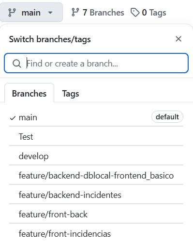
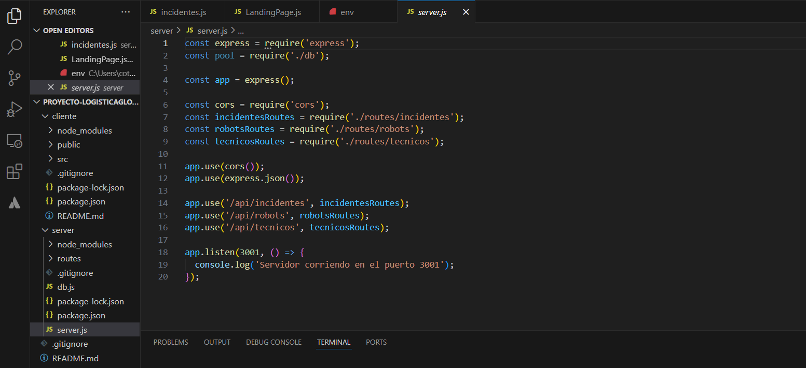
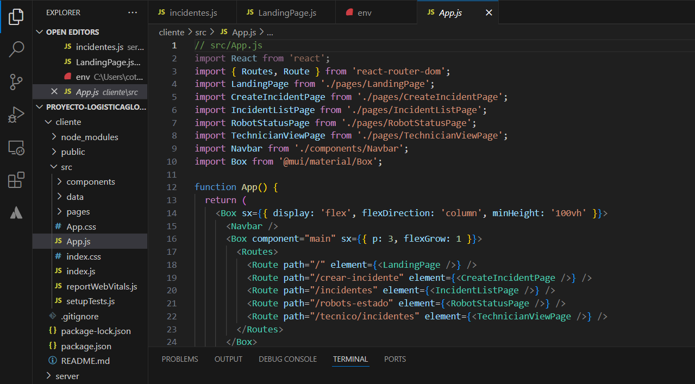
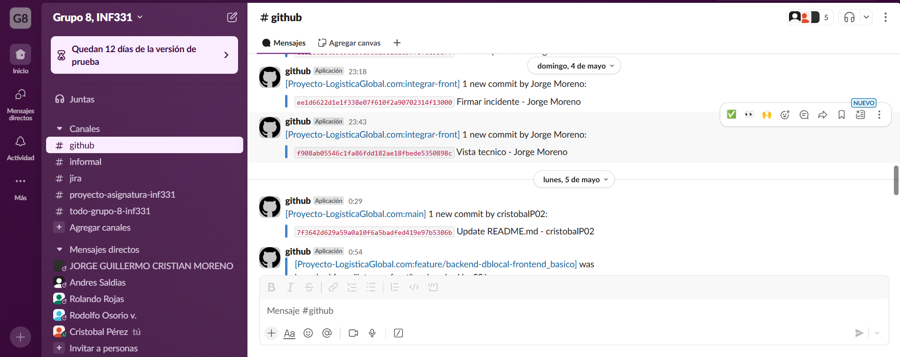
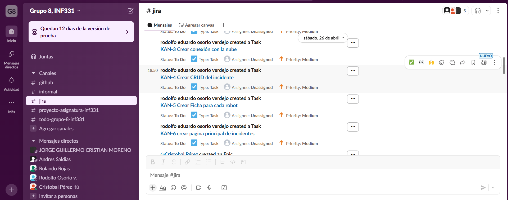
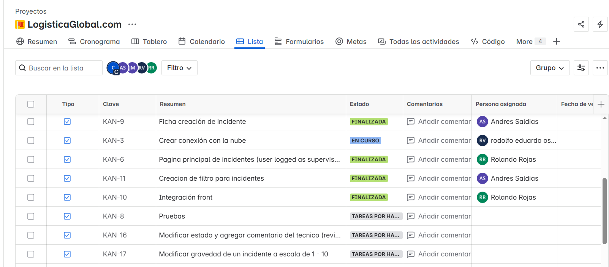
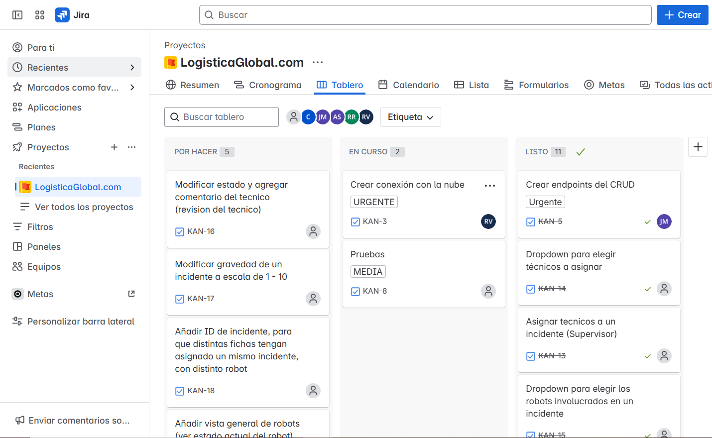
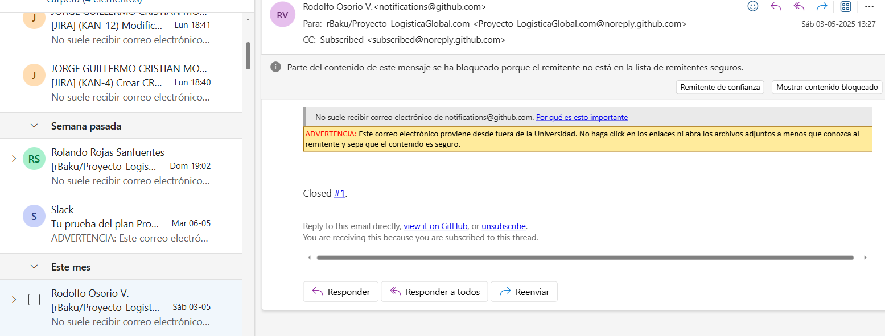

# Proyecto-LogisticaGlobal.com
Proyecto de Asignatura Pruebas de Software (IN-331), Universidad Técnica Federico Santa María. Proyecto realizado por el grupo 8, desarrollado por Jorge Moreno, Andres Saldias, Rolando Rojas, Rodolfo Osorio y Cristóbal Pérez.

### Link al video: https://youtu.be/0UcnRony0kU

## Objetivos, Alcances y Propósito
Se crea un sistema de registro de incidencias relacionadas a los accidentes de robots que ocurren en una fábrica, creado para mejorar la eficiencia, simplificar y optimizar el proceso que actualmente utiliza la **LogísticaGlobal.com**. Dicho proceso es manual, se realiza en varias etapas por distintos empleados y resulta engorroso, dificultando la operatividad de los almacenes, especialmente para los supervisores de operaciones.

El sistema busca ser capaz de guardar y eliminar las incidencias, revisar y filtrar las incidencias guardadas, permitir modificar las incidencias en cada etapa que se maneja actualmente, solo permitiendo al usuario indicado modificar las incidencias en la etapa que le corresponde. Además, el sistema apoyara la creación del reporte mensual que actualmente realiza el supervisor.

Aunque la empresa le gustaría tener un panel administrativo para gestionar las cuentas, se ha considerado que no es de lo más importante en el sistema, por lo que probablemente no se llegará a realizar, de forma similar, es posible que no se llegue a realizar pruebas sobre el uso del sistema en diversos dispositivos.

## Descripción de lo realizado

Descripción de cada vista importante del sistema, considerar que el sistema guarda información, no solo de las incidencias, sino que también de robots y técnicos de la empresa, para más detalles, acceder cuando se mencione cada tema a un enlace a la [wiki](../../wiki).

- *Página inicial*: Una [página](../../wiki/Página-inicial) a la que se es dirigido al iniciar el sistema, desde aqui se puede acceder al estado de los robots, la creación de una incidencia y la lista de incidencias.

- *Manejo de las incidencias*: Para el proceso de las [incidencias](../../wiki/Incidencias-de-robots), se tienen las siguientes formas de interactuar con el sistema:

1. Creación de una incidencia: Para la creación de la incidencia, se tiene una página que se accede desde la página inicial, esta es vista por el supervisor y permite crear una incidencia nueva con 1 o más robots asociados, si hay más de uno, se crean varias incidencias en el sistema.

2. Observar las incidencias guardadas: Para observar una lista de las incidencias que se han guardado actualmente, hay una página que se accede desde la página inicial. Donde se muestran los diversos datos asociados a cada incidente, como los IDs, la fecha, ubicación, entre otros.

3. Observar los detalles de un incidentes: En la página donde se observa la lista, se puede acceder a los detalles de cada incidente, donde se mostrará un modal con cada detalle.

4. Editar una incidencia: A lo largo de cada etapa del proceso que sigue la empresa con los incidentes, es necesario editar en más de una ocasión, por lo que en la lista de incidentes, también se puede acceder a editar cada una de estas, lo que despliegará un modal.

5. Eliminar una incidencia: De igual manera que los dos casos anteriores, en la lista de incidencias se da la opción de eliminar cada una de estas, al presionar el ícono se eliminará permanentemente del sistema.
  
- *Manejo de los robots*: Dentro de la empresa, una parte fundamental son los [robots](../../wiki/Robots-de-la-empresa), dentro del sistema se guardan los robots para que sean fácilmente accesibles al crear una incidencia, por lo que se tiene una página que es accesible desde la página inicial. Esta página despliega la lista de los robots guardados actualmente en el sistema, donde también se pueden eliminar estos robots y crear nuevos para ser guardados en el sistema.

- *Vista de técnicos*: Luego de que un supervisor revise la incidencia, se le asigna a uno o más [técnicos](../../wiki/Vista-de-técnicos) que se revisen los robots que estuvieron involucrados, por ello se creó una vista para que los técnicos puedan conocer las incidencias que han sido asignados a ellos, mostrando una lista de incidentes, donde se pueden editar según el proceso que se sigue en la empresa.

## Tecnologías usadas

- *Backend*: Para el backend del sistema, se uso node.js y express, tecnologías de javascript utilizadas para el desarrollo del sistema web, express se utilizó especialmente en la creación de las APIs, para comunicar el sistema y la base de datos que guardaba la información de los trabajadores, robots e incidencias.

- *Base de Datos*: La base de datos utilizada para el sistema es postgreSQL, una base de datos relacional, útil para relacionar las incidencias con los trabajadores y robots.

- *Nube*: Se asignó a la pipeline del proyecto, una pipeline de Azure, un servicio de información en la nube de Microsoft.

- *Frontend*: Para el frontend del sistema, se utilizo React, un Framework útil para crear la interfaz del sistema web, utilizado para manejar las rutas de la interfaz del sistema, la creación y edición de las incidencias, el filtro y búsqueda de estas

- *Testing*: Para realizar las pruebas del sistema, se utiliza Mocha/Chai, una herramienta de pruebas de Javascript, en especial útil para probar Node.js.

## Evidencias del trabajo

El codigo se subio a Github para coordinar el avance colaborativo del código, como se ve en la imagen.

Se manejan las ramas en base a Gitflow, con ramas main, develop y features.

Ejemplos del código para la entrega 1 de la asignatura de Pruebas de Software, backend y frontend.

Se integró junto a github distintas herramientas para el apoyo del equipo y la coordinación en el desarrollo del proyecto, como se muestra a continuación:

1. **Slack**: Se integro un bot que avisa de la creación de ramas, cuando se realiza un push o pull en Github. Además también se integró con Jira, como se ve en las siguientes imagenes.

2. **Jira**: Se crea un equipo de Jira para manejar las tareas a realizar durante el proyecto, para coordinar el equipo y realizar avances. Como se ve en las imágenes, se utiliza Kanban para gestionar las tareas y se priorizan según la urgencia para el proyecto.

3. **Correo electrónico**: Para tener otro canal de información sobre los avances realizados por el equipo en Github, se configuró que los push realizados envíen un correo, lo que permite inmediatamente acceder al repositorio.

## Supuestos y dependencias

- Uno de los supuestos considerados, es que al crear una incidencia, si hay más de un robot involucrado, se creará más de una incidencia en el sistema, esto para actualizar el estado de cada robot de forma individual en las etapas posteriores del proceso. Se mantiene un mismo ID de incidencia para asociar a los robots en el mismo accidente, solo en el sistema se guarda de forma distinta.

- Se consideró guardar datos sobre robots y técnicos, esto para facilitar el acceso a estos datos en diferentes instancias. Por ejemplo, el ID de los robots son utilizados al crear una incidencia, pues al intentar asignar robots, se despliega una lista con los IDs guardados en el sistema; de mismo modo, los técnicos guardados pueden ser accedidos cuando un supervisor quiere asignar técnicos mientras edita una incidencia, la primera vez que la revisa.

- Se tienen dependencias de las tecnologías mencionadas anteriormente, además de los módulos utilizados y que son instalados al seguir las instrucciones de instalación.

## Instrucciones de instalación

1. Descargar el repositorio de la rama main.

2. Acceder desde la terminal de línea de comandos a las carpetas del server y cliente (por ej: *cd cliente*) y escribir el comando *npm install*, lo que hará que se descarguen las dependencias utilizadas en el sistema. **Importante: Se debe tener descargado Node.js para realizar esto, para descargar Node.js: [Instrucciones Descarga](https://nodejs.org/en/download)**.

3. Se debe configurar la cuenta de Microsoft Azure en un equipo con azure cli, para habilitar la nube.

4. Se debe configurar un archivo .env que tenga la información para conectarse a la base de datos (nube). Los datos a configurar son:

- *DB_HOST*: El host de la base de datos Microsoft Azure.

- *DB_USER*: El usuario que tiene acceso a la base de datos, puede ser un correo electrónico.

- *DB_NAME*: Nombre de la base de datos de la nube.

- *DB_PORT*: Puerto a donde accede el sistema a la base de datos.

5. Utilizar **npm start** en las carpetas de server y cliente, al igual que cuando se instalaron las dependencias, para que empiece a funcionar el backend y frontend, correspondientemente.

## Documentacion De pruebas
- Se creó el documento siguiente, el cual contiene la metodología de pruebas, resultados esperados y obtenidos tanto del Frontend como del Backend. Este se encuentra en el siguiente link: https://usmcl-my.sharepoint.com/:w:/g/personal/andres_saldiass_usm_cl/EYrGcR5v3ghHtDwJL9IgaCkBCw4f6tbPU4bSFl4wXoow1g?e=uZwyWI
  

